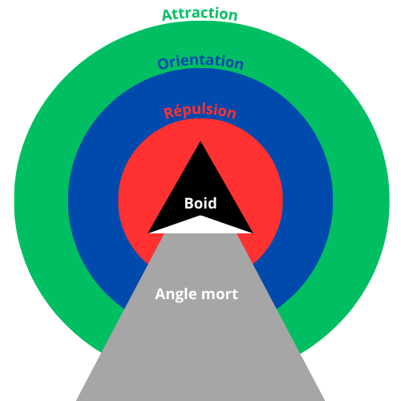

# Chapitre 5 : Flocking (mouvements de foule)

## Rappels

### Concepts

Le but de l’introduction d’une « IA » dans les jeux est de proposer des interactions avec le joueur, la plupart du temps pour que le comportement des PNJ (ennemis, alliés…) bien qu’automatisé soit comparable à celui qu’aurait eu un joueur humain. [Pac-man](https://pacman.com/) est le premier jeu a proposer une telle AI de manière significative : les monstres donnent l’impression d’adapter leurs comportements à celui du joueur, sont des adversaires coriaces et ont des caractères différents les uns des autres. Les PNJ sont aussi amenés à interagir entre eux, coordonner leurs actions, interagir avec le monde.

Pendant longtemps et dans la majorité des jeux, l’IA intervenait sur trois points :

Du point de vue des agents/élément du jeu (en général des PNJ) :

* adapter le comportement d’un agent (prise de décision) en fonction de la situation (p. ex. attaquer, fuir, attendre, se déplacer…)
* déplacer l’agent de la manière souhaitée (au bon endroit en suivant le bon itinéraire)

Du point de vue plus global du jeu :

* mettre en œuvre la bonne stratégie pour coordonner les actions des agents pour atteindre le résultat souhaité (donner du fil à retordre au joueur)

Depuis quelques années on pourrait rajouter un 4<sup>e</sup> point qui est en fait juste un niveau de sophistication supérieur des points précédents :

* enrichir les éléments qui permettent une meilleure immersion du joueur : réelle collaboration des alliés, richesse des dialogues et des réponses, évolution du monde, etc.

Vous avez déjà vu l’aspect stratégique avec la résolution de problème dans le chapitre précédent. Pour la suite, nous allons nous intéresser aux techniques de déplacement des agents (_flocking_ ou déplacement en nuées ou foule, _pathfinding_ pour qu’un agent détermine la meilleure trajectoire pour se déplacer, et les _finite-state machines_ les machines à états finis). 

### Outils

La plupart des algorithmes d’IA dans les jeux vidéos sont des algorithmes classiques et génériques faciles à implémenter dans la plupart des langages. Longtemps les jeux ont été intégralement développés en assembleur, C puis C++ (même si on n’oublie pas les heures de gloire du Basic sur les ordinateurs 8 bits) pour des raisons de performance, et ces langages demeurent des standards de l’industrie. Puis avec la multiplication des supports de jeu (ordinateurs de bureau, consoles de salon, mobiles, web) ainsi que la montée en puissance des machines, le nombre de langages utilisé s’est diversifié. Enfin avec l’avènement des moteurs de jeux (qu’ils soient maison ou tiers comme _Unity_  ou _Unreal Engine_) il est devenu courant d’avoir des éléments de jeu codées de manière scriptée. Par ailleurs on verra qu’obtenir le comportement souhaité avec ces algorithmes d’IA demande un réglage assez fin de paramètres (constantes, fonctions d’évaluation…) par essai-erreur, on ne peut pas se permettre de recompiler un projet entier à chaque fois, d’autant que les personnes en charge de ces ajustements peuvent être des _level-designers_ qui ne maîtrisent pas forcément les langages de trop bas niveau. Il est donc courant d’utiliser des langages de scripts qui s’interfacent très bien avec le C/C++ : [Python](https://www.python.org/) et [Lua](https://lua.org/).

En outre ces deux langages sont dotés de frameworks qui permettent de prototyper des jeux 2D facilement et rapidement, ce qui les rend idéal dans le cadre d’un cours, je les utiliserai dans les exemples : [Pygame Zero](https://pgzero-french.readthedocs.io/fr/latest/) et [LÖVE2D](https://love2d.org/) 

#### Python

Syntaxe relativement claire, accessible aux débutants, dispose d’une bibliothèque standard très bien fournie et des bibliothèques de référence ([Scikit-Learn](https://scikit-learn.org/), [Tensorflow](https://www.tensorflow.org/), [PyTorch](https://pytorch.org/)) en IA/Machine Learning. Ces bibliothèques sont optimisées et ont d’excellentes performances malgré le fait que Python soit un langage interprété.

Sauf cas très particulier ces bibliothèques n’ont aucune utilité pour développer de l’IA basique dans un jeu vidéo. Par ailleurs par conception Python ne peut pas abaisser le temps d’exécution en dessous d’une certaine limite même pour des tâches de base (appels de fonctions…), et vu l’étendue de sa bibliothèque standard, il occupe vite de la place. Je n’ai pas d’exemple en tête d’embedding de Python dans des jeux pro.

Néanmoins, c’est un excellent outil pour apprendre, et le nombre de bibliothèques disponibles facilitera de beaucoup l’implémentation de nombreux algorithmes.

C’est une excellente solution pour créer ou tester des exemples ou des prototypes de jeu en 2D. On trouve de nombreux projets et exemple de jeux à but pédagogique développés à l’aide de la bibliothèque [Pygame](https://www.pygame.org/), basée sur la [SDL](https://www.libsdl.org/). Mais je recommande plutôt l’usage de Pygame Zero, beaucoup plus rapide à mettre en œuvre, en évitant les lourdeurs de Pygame (où il faut expliciter trop de choses : ouverture de la fenêtre, création de la boucle de jeu).

Pour l’installer, après avoir créé un environnement virtuel (cf. cours d’intro) :

```bash
pip install pgzero
```

Le site de Pygame Zero consiste en un [tutoriel](https://pgzero-french.readthedocs.io/fr/latest/) (en français) est très bien fait et permet d’être rapidement opérationnel.

#### Lua

Lua est un langage interprété dont la syntaxe est très proche du Basic, il est donc facile à lire et à apprendre. Il a été conçu pour être utilisé par des non-spécialistes (à l’origine des ingénieurs de l’industrie pétrolière). Il a donc quelques bizarreries (la plus frappante est que l’index des tables commence à 1 et non à 0) mais ça ne pose pas de grandes difficultés. Il est extrêmement léger (<200ko !!!), il est populaire dans le monde des systèmes embarqués et c’est probablement le langage interprété le plus rapide. Il a toute sa place dans l’écosystème IA ([Torch](http://torch.ch/) est développé en LuaJIT). Son API C est très simple, c’est un outil de scripting qui est devenu un standard dans l’industrie du jeu vidéo : World of Warcraft, Far Cry pour citer les plus populaires, Luau dans Roblox est basé sur Lua. Lua est aussi beaucoup utilisé pour créer des mods. 

Son apparente simplicité (syntaxique) ne doit pas cacher le fait qu’il parvient à être à la fois flexible et léger grâce à des mécanismes très puissants (réflexivité, [coroutines](https://fr.wikipedia.org/wiki/Coroutine), [continuations](https://fr.wikipedia.org/wiki/Continuation_(informatique)), etc.) qui lui permettent, même si c’est un langage [procédural](https://fr.wikipedia.org/wiki/Programmation_proc%C3%A9durale) à la base, d’adopter différents paradigmes : programmation objet, [fonctionnelle](https://fr.wikipedia.org/wiki/Programmation_fonctionnelle), [concurrente](), etc. Sur ce sujet, [voici un article](https://www.inf.puc-rio.br/~roberto/docs/ry09-03.pdf) de [Roberto Ierusalimschy](https://en.wikipedia.org/wiki/Roberto_Ierusalimschy), créateur du langage Lua. Pour la programmation objet, je ne peux que vous recommander d’utiliser le module [classic](https://github.com/rxi/classic) très simple, et qui facilite la programmation orientée objet en Lua (constructeur, héritage, métaméthodes pour le polymorphisme, etc.).

[LÖVE2D](https://love2d.org/) est un framework Lua pour la réalisation de jeu 2D basé sur la [SDL2](https://www.libsdl.org/). Facile à prendre en main ([tutoriels en français](https://love2d.org/wiki/Getting_Started_(Fran%C3%A7ais))) il est utilisé aussi pour le développement de jeux pro (dernier exemple en date : [Balatro](https://www.playbalatro.com/) qui a connu un très grand succès). Pour ne rien gâcher, on peut très facilement générer une version Javascript des jeux en LÖVE2D avec [love.js](https://github.com/Davidobot/love.js/).

Je vous encourage donc à adopter l’un de ces deux frameworks (Pygame Zero ou LÖVE2D) pour mettre en œuvre et jouer avec les algorithmes et les projets de ce cours. Vous pourrez aussi trouver des exemples et des tutoriels (en cours de rédaction pour certains) sur le dépôt du Code Club que je co-anime au FabLab de Briançon : https://github.com/orgs/aucoindujeu/repositories

Pour apprendre rapidement le Lua (et d’autres langages) : https://learnxinyminutes.com/docs/fr-fr/lua-fr/

## Le Flocking

Nous allons voir dans ce cours une technique qui se rapporte à la thématique IA/déplacements, qui nous permettra d’implémenter des mouvements de foule (c’est-à-dire le déplacement coordonnée d’un grand nombre d’agents ) avec une grande fluidité et un certain réalisme.

Exemple : https://jehadel.github.io/love-boids/

L’algorithme qui se cache derrière ce comportement se rapporte à ce que l’on appelle des comportement _émergents_ ou _auto-organisés_ ou encore relatif à la _complexité_.

### Exemple d’émergence : le jeu de la vie

La complexité que l’on évoque à ce propos est celle de comportements en apparence complexes au niveau global, alors qu’il n’existe aucune règle de « haut-niveau », seulement des règles très simples qui n’interviennent qu’au niveau individuel, celui de chacun des agents. Malgré tout on voit à partir de ces interactions de base émerger des comportements *complexes*, comme si les agents s’étaient concertés ou *auto-organisés*.

Un exemple fondamental de ce type de recherche est celui du jeu de la vie de Conway (1970), qui est ce que l’on appelle un _automate cellulaire_.

Ce « jeu » (qui se déroule sans intervention d’un joueur, hormis pour la définition de l’état initial) consiste en une grille (théoriquement infinie, mais qui peut avoir une géométrie de tore, les extrémitées haut, bas et gauche, droite étant respectivement connectées) en deux dimensions. Chaque case de la grille représente une « cellule » qui peut être dans deux états seulement : morte ou vivante. 

Chaque cellule possède huit voisine (huit directions). A chaque itération l’état d’une cellule est défini par les règles suivantes :

* une cellule morte entourée de 3 cellules vivantes naît (devient vivante)
* une cellule vivante entourée de 2 ou 3 cellules vivantes reste vivante, sinon elle meurt (moins de 2 -> sous population, plus de 3 -> surpopulation)

On définit quelles cellules de la grille sont vivantes et on lance les itérations : à chacune d’entre elles on évalue par application des règles précédentes quelles cellules sont vivantes et lesquelles sont mortes.

On constate que des motifs particulièrement simples peuvent donner naissance à d’autres motifs ou des mouvements particulièrement complexes (p. ex. le « U », les « canons, etc.), certains motifs étant stables, d’autres étant voués à disparaître.

https://playgameoflife.com/ (expérimenter différents motifs, cf. le lexicon)

Une base de jeu de la vie avec Pygame Zero (à améliorer) : https://github.com/aucoindujeu/codeclub/tree/main/pygame/gameoflife

### Les Boids

Qui n’a pas été déjà été hypnotisé par le vol des étourneaux en plein mois de décembre ?

[Craig W. Reynolds](https://en.wikipedia.org/wiki/Craig_Reynolds_(computer_graphics)) a proposé en 1986 une simulation de ces vols en nuées d’oiseaux qui a fait la sensation à la [SIGGRAPH](https://s2024.siggraph.org/) l’année suivante. Il a surnommé les agents qui se déplaçaient ainsi des boids (bird - oids) Ces déplacement en nuées très fluides émergent de trois règles très simples :

* séparation : deux boids ne peuvent pas être au même endroit au même moment
* cohésion : les boids vont avoir tendance à se rapprocher pour former un groupe
* alignement : les boids volent dans la même direction et à la même vitesse pour rester groupé

Pour opérer ces règles, on définit pour chaque boid différentes zones (la forme la plus simple sont des cercles centrées sur le boid et de rayons différents) pour lesquelles la présence d’un autre boid va déclencher trois comportements différents :

* une zone de répulsion (la plus proche du boid) : si un autre boid est dans cette zone, le boid va s’en éloigner
* une zone d’attraction (la plus éloignée du boid) : si un autre boid est dans cette zone, le boid va s’en rapprocher
* une zone d’orientation (intermédiaire) : si un autre boid est dans cette zone, le boid va le suivre, en alignant sa direction et sa vitesse)
* le boid sera indifférent à tout ce qui est au delà de la zone d’attraction on peut aussi définir un angle mort derrière le boid auquel il sera également insensible 




On peut conceptualiser le problème également en imaginant que chaque boid se déplace dans une direction et à une vitesse donnée, et 3 forces de nature différente vont s’appliquer à chaque boid : répulsion, attraction ou alignement/centering que l’on va pondérer avec différents paramètres

* Un boid va être attiré par le barycentre de la position des boids qu’il « voit »
* Un boid va ajuster sa vitesse à la moyenne de la vitesse des boids autour de lui
* Un boid va garder ses distances avec les boids qui sont « trop proches »

### Exemple de code

```lua

-- **********************************
-- Demo variables
-- *********************************

-- Constants
W_WIDTH = 800
W_HEIGHT = 600
W_LIMIT = 40

N_BOIDS = 80
CVISUAL_RANGE = 60 -- could be an individual boid property
DEAD_ANGLE = 60
V_TURN = 2 -- could be an individual boid property
MINDISTANCE = 20
VMAX = 100

AVOIDANCE = 30 
COHESION = 2 
CENTERING = 270

-- boids table
local boids = {}
boids.list = {}
boids.img = love.graphics.newImage('pix/boid.png')
boids.w = boids.img:getWidth()
boids.h = boids.img:getHeight()

-- *****************
-- Fonctions
-- *****************

function distance(pBoid1, pBoid2) 

  return math.sqrt((pBoid1.x - pBoid2.x)^2 + (pBoid1.y - pBoid2.y)^2)

end

-- Boids 
function createBoid()

  local boid = {}
  boid.x = math.random(W_LIMIT, W_WIDTH - W_LIMIT) 
  boid.y = math.random(W_LIMIT, W_HEIGHT - W_LIMIT)
  boid.vx = math.random(-VMAX, VMAX)  
  boid.vy = math.random(-VMAX, VMAX) 

  return boid

end


function cohesion(pBoid, pVisualRange)

  local delta = {}
  local dVx = 0
  local dVy = 0
  local nearBoids = {}
  local sumX = 0
  local sumY = 0
  local sumVx = 0
  local sumVy = 0
  local n = 0

  for index, otherBoid in ipairs(boids.list) do

    if distance(pBoid, otherBoid) < pVisualRange then
      sumX = sumX + otherBoid.x
      sumY = sumY + otherBoid.y
      sumVx = sumVx + otherBoid.vx
      sumVy = sumVy + otherBoid.vy
      n = n + 1
    end
  end

  delta.dx = sumX/n - pBoid.x
  delta.dy = sumY/n - pBoid.y
  delta.dVx = sumVx/n - pBoid.vx 
  delta.dVy = sumVy/n - pBoid.vy
  
  return delta

end


function keepDistance(pBoid, pMinDistance)

  local dist = {}
  dist.dx = 0
  dist.dy = 0
  
  for index, otherBoid in ipairs(boids.list) do
    if pBoid ~= otherBoid then
      if distance(otherBoid, pBoid) < pMinDistance then
        dist.dx = dist.dx + (pBoid.x - otherBoid.x)
        dist.dy = dist.dy + (pBoid.y - otherBoid.y)
      end
    end
  end

  return dist 

end


function keepInside(pBoid, pVTurn, pLimit)

  local turn = {}
  turn.dVx = 0
  turn.dVy = 0


  if pBoid.x < pLimit then
    turn.dVx = pVTurn
  end

  if pBoid.x > W_WIDTH - pLimit then
    turn.dVx = - pVTurn
  end

  if pBoid.y < pLimit then
    turn.dVy = pVTurn 
  end

  if pBoid.y > W_HEIGHT - pLimit then
    turn.dVy = - pVTurn 
  end

  return turn 

end

-- ****************************
-- INITIALISATION
-- ****************************

function initDemo()
  
  for n = 1, N_BOIDS do
    table.insert(boids.list, createBoid())
  end

end


function love.load()

  love.window.setMode(W_WIDTH, W_HEIGHT)
  love.window.setTitle('Reynolds’ Boids')

  initDemo()

end


-- ******************
-- UPDATE
-- ******************

function love.update(dt)

  for index, boid in ipairs(boids.list) do 

    -- align position and speed with that of others
    cohesionForce = cohesion(boid, CVISUAL_RANGE)
    -- boids avoid each other
    avoidanceForce = keepDistance(boid, MINDISTANCE)
    -- boids return to the center when approching window’s edges
    centeringForce = keepInside(boid, V_TURN, W_LIMIT)

    -- boids speed adjustement according all forces
    -- we could add ponderations
    boid.vx = boid.vx + (avoidanceForce.dx * AVOIDANCE
                          + centeringForce.dVx * CENTERING
                          + (cohesionForce.dx 
                            + cohesionForce.dVx) * COHESION
                        ) * dt

    boid.vy = boid.vy + (avoidanceForce.dy * AVOIDANCE
                        + centeringForce.dVy * CENTERING
                        + (cohesionForce.dy 
                          + cohesionForce.dVy) * COHESION
                        ) * dt

    -- speed limitation
    if math.abs(boid.vx) > VMAX then
      boid.vx = boid.vx/math.abs(boid.vx) * VMAX
    end
    if math.abs(boid.vy) > VMAX then
      boid.vy = boid.vy/math.abs(boid.vy) * VMAX
    end

    -- move boid according to its speed
    boid.x = boid.x + boid.vx * dt
    boid.y = boid.y + boid.vy * dt

  end

end


-- ***************
-- DRAWING 
-- ***************

function love.draw()

  for index, boid in ipairs(boids.list) do
    love.graphics.draw(boids.img, boid.x, boid.y, -math.atan2(boid.vx, boid.vy), .67, .67, boids.w/2, boids.h/2)
  end

end

-- ******************
-- Quit demo
-- ******************

function love.keypressed(key)

  if key == 'escape' then
    love.event.quit()
  end

end
```

## Exercices et projet

* se familiariser avec cette démo en l’enrichissant : 
  * dans un premier temps voir les effets de la modification des paramètres
  * on peut ajouter de l’interactivité en permettant à l’utilisateur de modifier les paramètres à la volée
  * on peut aussi faire varier les caractéristiques individuelles des boids pour voir ce qu’il se passe au niveau du groupe
  * on peut ajouter un prédateur, on peut faire en sorte que les boids soient attirés par le pointeur
  * on peut désigner quelques boids comme leader (quel effet sur le groupe ?) etc.
* ce type d’algorithme n’est pas seulement utile pour les être vivants, il peut servir aussi pour des effets de particules
* je propose [une base d’atelier](https://github.com/Jehadel/Base-Atelier-Cours) (un sprite qui se déplace dans une grille), ajouter des sprites qui suivent le personnages (comme les familiers du magicien, ou des fantômes, ou une « aura » de particules, etc.). Vous pouvez utiliser aussi le framework ou les idées que vous avez !
