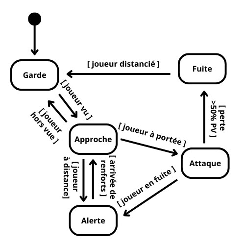
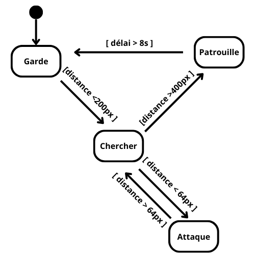
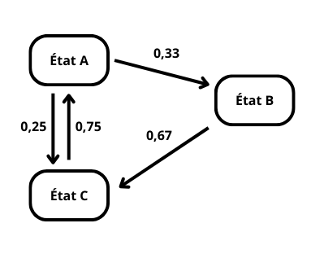
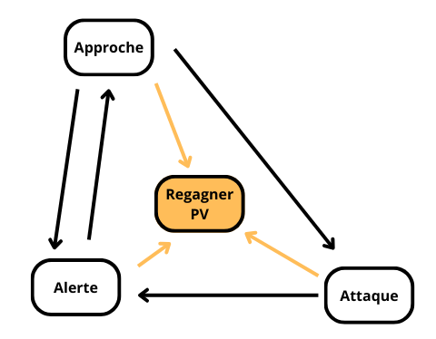
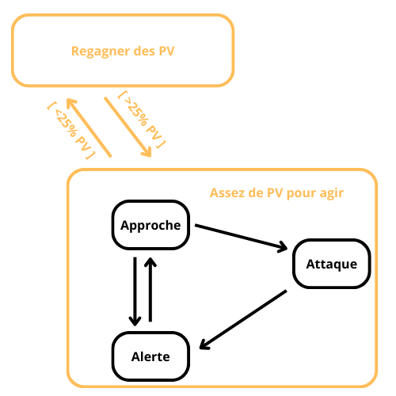
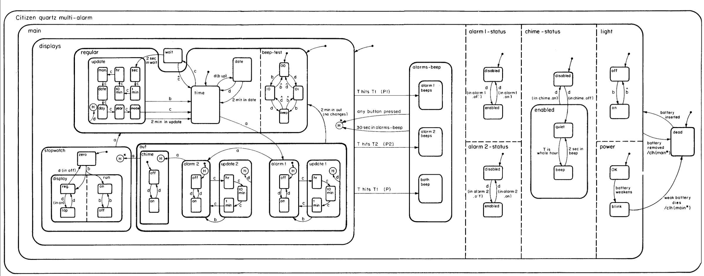
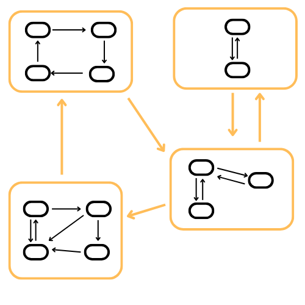

# Chapitre 7 : Machines à états finis

Dans les jeux, les joueurs sont amenés à être confrontés à des PNJ (alliés ou antagonistes) qui seront amenés à réagir à différents événements en jeux, en montrant un ensemble de comportements relativement limités mais organisés entre eux de manière logique.

Par exemple dans un jeu d’aventure action (Zelda, etc.) il est courant que des sentinelles montent la garde et que, à l’approche du joueur, elles quittent leur poste pour se diriger vers lui ou au moins patrouiller, et, arrivées à sa portée, l’attaquent. Il est possible que si le joueur a su rester hors d’atteinte suffisamment longtemps, une sentinelle « décide » de revenir à son poste et de monter à nouveau la garde. 

Autre exemple, dans le jeu Pac-Man, les fantômes réagissent différemment (attaque, fuite, errance) en fonction de la phase de jeu, et même avec des différences inter-individuelles entre les fantômes (qui acquièrent ainsi une forme de personnalité).

Les machines à états finis (ou automates finis) sont une formalisation mathématiques permettant de décrire les transitions entre ces comportements. 

## Machines à états finis

Si l’on regarde de plus près le comportement des sentinelles que nous avons mentionnées plus haut, on constate qu’à chaque fois l’agent concerné (sentinelles, PNJ) adapte son comportement a des stimuli extérieurs (approche du joueur, stimuli « visuels » ou « auditifs » par exemple) mais que ces stimuli n’auront pas le même effet selon le comportement en cours de l’agent : si la sentinelle est postée, en attente, la perception d’un stimuli va la mettre en mouvement (patrouille, ou se diriger vers le stimuli). Par contre si la sentinelle attaque le joueur, elle ne sera plus sensible aux stimuli éloignés. Les comportements sont déclenchés par l’interaction entre des stimuli extérieurs (état du monde) et la disposition de l’agent (son état interne), interaction qui produit donc des effets variés. Un diagramme (p. ex. avec le formalisme UML) nous aide à *modéliser* comment un agent passe d’un comportement à l’autre (*transition*) en fonction des stimuli externes (*conditions*) et de ses *états internes*.

Dans le cas de notre sentinelle :



Formalisme UML : 

* boîtes arrondies : états
* transitions : flèches
* conditions : entre crochets, associées aux transitions qu’elles déclenchent
* le disque noir suivi d’une flèche représente l’initialisation de l’agent, qui adoptera l’état « Garde » au départ

Une machine a états finis (FSM - *Finite State Machine*) est définie comme son nom l’indique par un ensemble d’états dont le nombre est déterminé (fini). A un moment donné, la machine occupe un état et un seul. Cet état détermine l’action ou le comportement associé avec cet état. Tant qu’une FSM reste dans le même état, elle montrera le même comportement. 

On définit le passage d’un état à l’autre par des *transitions*, qui sont déclenchées par des conditions. Techniquement on peut distinguer le moment où les conditions sont remplies (*trigger*) et celui où la transition a conduit au nouvel état (*fired*). 

C’est la grande différence avec les arbres de décisions : dans un arbre, on considère simultanément toutes les décisions/comportements possibles, et à tout moment on peut parcourir l’arbre pour déclencher telle ou telle action. Dans le cas des FSM on n’a accès qu’aux transitions attachées à l’état actuel, et donc aux états « voisins » de l’état courant. Les autres états sont hors de portée.

Attention à bien prévoir une condition de sortie (transition) pour chaque état, sinon cet état constituera une impasse dont l’agent ne pourra jamais sortir.

## Implémentation

Il y a de très nombreuses façon d’implémenter une FSM. Certaines élémentaires (une liste des états et une série de test *if…then…else…* pour gérer les transitions et les actions associées aux états), un peu plus élaborés (dictionnaires) ou très élaborées (classe, polymorphisme…). Il n‘y a pas de règle, chaque développeur crée son propre système, seule compte la flexibilité et la lisibilité.

Il ne faut pas perdre de vue que les FSM sont très bien adaptées quand le nombre de comportements sont assez stéréotypées et peu nombreux. Pratiquement tous les jeux sortis entre 1980 et début 2000 n’utilisaient rien d’autre que des FSM, c’est une méthode qui est très souvent suffisante pour gérer le comportement des PNJ dans un jeu, qui pour être jouable et convaincre son public n’a pas toujours besoin d’une IA très élaborée, mais plutôt « équilibrée » ou alignée avec l’expérience des joueurs. Donc l’implémentation a rarement besoin d’être très élaborée. 

[Ian Milllington](https://fr.wikipedia.org/wiki/Ian_Millington) propose dans son ouvrage [AI for Games](https://www.taylorfrancis.com/books/mono/10.1201/9781351053303/ai-games-third-edition-ian-millington) un algorithme et un cadre général pour les implémenter dans le paradigme objet (notamment en ayant recours au polymorphisme) pour avoir le maximum de souplesse. Aujourd’hui beaucoup de moteurs de jeux disposent de modules pour définir des FSM y compris de manière graphique, à destination des game designers car ce sont plutôt à eux qu’échoient la tâche de définir finement le comportement d’ennemis situés ici ou là dans le jeu.

Vu le temps imparti pour ce cours,  je vais plutôt vous proposer une approche très simple voire naïve, qui fut celle adoptée pendant longtemps : le comportement des agents (PNJ) est programmé en dur dans le code du jeu, ce qui fut longtemps le cas cas quand les jeux étaient développés en C ou en assembleur, etc. Cela fait un usage massif des structures *if…then…elseif…else…* ou des *switch… case…* quand cette dernière possibilité est accessible. On pourra bien sûr utiliser aussi des structures plus lisibles et maintenables en faisant par exemple appel à des dictionnaires. Mais pour ce cours il est plus important de faciliter la prise en main du concept, en vous encourageant à chercher le type de structure de données et le paradigme qui vous conviendra le mieux, c’est-à-dire le plus efficient pour votre cas d’usage, le framework, moteur ou environnement que vous utilisez. Nous n’allons pas ici décrire des abstractions dont de toute façon vous n’aurez pas forcément l’usage. De plus cette méthode, directe, est souvent la plus performante.

Voici un exemple où on imagine la situation suivante : le joueur fait face à une sentinelle qui monte la garde. Celle-ci part à sa poursuite s’il s’approche trop près, l’attaque si elle parvient à le rattraper, patrouille (suit une direction aléatoire) si le joueur parvient à s’éloigner, et se remet à monter la garde au bout d’un certain temps de patrouille. Le schéma suivant reprend les comportement que nous venons de décrire :



Le code de cet exemple (commenté en cours) :

```Lua
-- calculer distance euclidienne entre deux points

LARGEUR_ECRAN = 800
HAUTEUR_ECRAN = 600
DISTANCE_ALERTE = 200
DISTANCE_PERTE = 400
DISTANCE_ATTAQUE = 64 
DELAI_COMPTEUR = 50
VITESSE_SENTINELLE = 45

function get_dist(x1,y1, x2,y2)

    return math.sqrt((x2-x1)^2+(y2-y1)^2)

end

-- calculer angle entre deux points depuis l’origine de l’écran
function get_angle(x1,y1, x2,y2) 

    return math.atan2(y2-y1, x2-x1) 

end


-- on définit le joueur
local joueur = {}
joueur.image = love.graphics.newImage('Joueur.png')
joueur.x = (LARGEUR_ECRAN - joueur.image:getWidth()) / 2 
joueur.y = HAUTEUR_ECRAN * 3 / 4
joueur.speed = 200

-- on définit la sentinelle 
local sentinelle = {}

-- on définit les états possibles
sentinelle.lst_Etats = {}
sentinelle.lst_Etats.GARDE = 'Garde'
sentinelle.lst_Etats.CHERCHE = 'Cherche'
sentinelle.lst_Etats.ATTAQUE = 'Attaque'
sentinelle.lst_Etats.PATROUILLE = 'Patrouille'
sentinelle.etat = sentinelle.lst_Etats.GARDE
sentinelle.compteur = 0

for k, v in pairs(sentinelle.lst_Etats) do
    print(k, v)
    sentinelle['image_'..v] = love.graphics.newImage(v..'.png')
end

sentinelle.x = (LARGEUR_ECRAN - sentinelle.image_Garde:getWidth()) / 2
sentinelle.y = 0
sentinelle.vx = 0 
sentinelle.vy = 0
sentinelle.fixe_vitesse_patrouille = false

function update_image_sentinelle()

  sentinelle.image_courante = 'image_'..sentinelle.etat

end

update_image_sentinelle()


function love.load()

    love.window.setMode(LARGEUR_ECRAN, HAUTEUR_ECRAN)
    love.window.setTitle('Naive FSM')

end


function update_sentinelle(dt)


  -- on aura besoin de connaître la position par rapport au joueur
  local dist = get_dist(sentinelle.x + sentinelle[sentinelle.image_courante]:getWidth()/2, 
                        sentinelle.y + sentinelle[sentinelle.image_courante]:getHeight()/2, 
                        joueur.x + joueur.image:getWidth()/2, 
                        joueur.y + joueur.image:getHeight()/2)
  local angle = get_angle(sentinelle.x + sentinelle[sentinelle.image_courante]:getWidth()/2, 
                          sentinelle.y + sentinelle[sentinelle.image_courante]:getHeight()/2, 
                          joueur.x + joueur.image:getWidth()/2, 
                          joueur.y + joueur.image:getHeight()/2)

  if sentinelle.etat == nil then

    print(' ERREUR état sentinelle indéfini (nil)')

  end


  if sentinelle.etat == sentinelle.lst_Etats.GARDE then

    -- dans cet état, on ne fait rien. 
    sentinelle.vx = 0
    sentinelle.vy = 0

    -- On attend juste que le joueur passe à proximité
    -- ce qui nous amènera à l’état « cherche »

    if dist < DISTANCE_ALERTE then
      sentinelle.etat = sentinelle.lst_Etats.CHERCHE
      update_image_sentinelle()
    end

  elseif sentinelle.etat == sentinelle.lst_Etats.CHERCHE then

    -- dans cet état on se dirige vers le joueur s’il n’est pas trop loin
    sentinelle.vx = VITESSE_SENTINELLE * math.cos(angle) * dt
    sentinelle.vy = VITESSE_SENTINELLE * math.sin(angle) * dt

    if dist > DISTANCE_PERTE then
      sentinelle.etat = sentinelle.lst_Etats.PATROUILLE
      update_image_sentinelle()
      -- on charge le compteur
      sentinelle.compteur = DELAI_COMPTEUR

    elseif dist < DISTANCE_ATTAQUE then
      sentinelle.etat = sentinelle.lst_Etats.ATTAQUE
      update_image_sentinelle()
    end

  elseif sentinelle.etat == sentinelle.lst_Etats.ATTAQUE then
    -- dans cet état, on attaque. Pas implémenté ici
    -- on pourrait faire perdre des PV au joueur, etc.
    -- dans tous les cas la sentinelle s’immobilise quand elle attaque
    sentinelle.vx = 0
    sentinelle.vy = 0

    -- on prévoit quand même une sortie de l’état si le joueur s’est éloigné

    if dist > DISTANCE_ATTAQUE then
      sentinelle.etat = sentinelle.lst_Etats.CHERCHE
      update_image_sentinelle()
    end

  elseif sentinelle.etat == sentinelle.lst_Etats.PATROUILLE then
   
    -- dans cet état on avance dans une direction au hasard et on change 
    if sentinelle.fixe_vitesse_patrouille == false then
      sentinelle.vx = VITESSE_SENTINELLE * (2 * math.random() -1) * dt
      sentinelle.vy = VITESSE_SENTINELLE * (2 * math.random() -1) * dt
      sentinelle.fixe_vitesse_patrouille = true
    end
    -- on retourne à l’état de garde si le compteur arrive à 0
    sentinelle.compteur = sentinelle.compteur - 10 * dt 
    if dist > DISTANCE_PERTE and sentinelle.compteur < 0 then
      sentinelle.compteur = 0
      sentinelle.etat = sentinelle.lst_Etats.GARDE
      update_image_sentinelle()
      sentinelle.fixe_vitesse_patrouille = false

    elseif dist < DISTANCE_PERTE then
      sentinelle.etat = sentinelle.lst_Etats.CHERCHE
      sentinelle.compteur = 0
      update_image_sentinelle()
      sentinelle.fixe_vitesse_patrouille = false
    end

  else

    print('----- ERREUR état sentinelle inconnu :' .. tostring(sentinelle.etat) .. ' -----')

  end

--  rajouter un test de collision bord écran 
    sentinelle.x = sentinelle.x + sentinelle.vx
    sentinelle.y = sentinelle.y + sentinelle.vy

end


function update_joueur(dt)

  if love.keyboard.isDown('up') and joueur.y > 0 then
    joueur.y = joueur.y - joueur.speed * dt

  elseif love.keyboard.isDown('right')  and joueur.x < LARGEUR_ECRAN - joueur.image:getWidth() then
    joueur.x = joueur.x + joueur.speed * dt

  elseif love.keyboard.isDown('down') and joueur.y < HAUTEUR_ECRAN - joueur.image:getHeight() then
    joueur.y = joueur.y + joueur.speed * dt

  elseif love.keyboard.isDown('left') and joueur.x > 0 then
    joueur.x = joueur.x - joueur.speed * dt
  end

end


function love.update(dt)

    update_joueur(dt)
    update_sentinelle(dt)

end


function love.draw()

    love.graphics.draw(sentinelle[sentinelle.image_courante], sentinelle.x, sentinelle.y)
    love.graphics.draw(joueur.image, joueur.x, joueur.y)

end


function love.keypressed(key)

  if key == "escape" then
    love.event.quit()
  end

end
```


## Limites et développements

Les FSM sont une solution assez rigide : c’est le programmeur qui décrit à l’avance l’ensemble du comportement des agents, et c’est parce que le jeu propose des situations assez stéréotypées et limitées que cela fonctionne assez bien. On peut néanmoins apporter un peu de souplesse et de vie aux FSM en altérant le déterminisme en ajoutant un peu de hasard, ce qui rendra le comportement de ces agents moins facile à prédire.



Ici l’implémentation demande néanmoins un peu de vigilance car on voit que l’état A peut conduire à l’état B ou à l’état C avec des probabilités différentes. 

Une autre méthode qui peut atténuer la prédictabilité des FSMs est de prévoir des transitions déclenchées par des événements différents mais qui ont lieu simultanément. L’issue sera altérée par la manière dont l’algorithme va parcourir les différentes transitions possibles, car cela va souvent avoir lieu de manière séquentielle (donc par exemple la transition A -> B serait évaluée avant la transition A -> C), introduisant un biais. Il faudrait ici par exemple que l’on envisage toutes les transitions possibles depuis A en même temps et en choisir une.

Il peut aussi y avoir un risque dans le cas de transitions concurrentes. Imaginons une transition qui pourrait survenir dans différents états, les court-circuiter en quelque sorte. Par exemple si les points de vie de notre sentinelle sont inférieur à 25%, fuir quel que soit l’état courant : approche, attaque, alerte… et regagner ses points de vie (avec une potion, etc.). Dans ce cas, si notre FSM n’a pas de mémoire de l’état que l’on vient de quitter, comment, une fois les points de vie regagner, revenir à l’état précédent cette interruption ?	



Une solution consiste à imbriquer les FSM : l’état « assez de PV pour agir » autoriserait les autres états et transitions donc les contiendrait, alors que l’état « regagner ses PV » serait un état à part sans lien avec ceux-ci. On n’a alors à gérer que la transition entre deux état : assez/pas assez de PV, et être dans l’état « assez de PV » autoriserait de déclencher les autres états et actions :



Il faut encore gérer l’interruption des sous-états (approche, attaque, alerte) et le retour à ces état quand les PV passe au-dessous puis au-dessus du seuil de 25%, et c’est au développeur de trouver les bonnes solutions avec chacune son lot de difficultés, mais dans ce cadre c’est beaucoup plus facile que précédemment. David Harel a proposé dans [un article de 1987](https://www.sciencedirect.com/science/article/pii/0167642387900359) un formalisme pour représenter des systèmes imbriqués et complexes, par exemple, pour une horloge à quartz multi-alarme :



On peut ainsi construire *un système hiérarchique de FSM*, ou les états d’une FSM sont en fait des FSM également. Cela permet de décomposer plus facilement un comportement complexe en une série de comportements plus simples, et aussi de rajouter à la sécurité du code et faciliter son organisation (une FSM peut être implémentée dans une fonction ou une classe particulière et appelée autant que nécessaire dans plusieurs endroits du code).



Rien n’interdit non plus de que les états d’une FSM soit en fait pour certains d’autres FSM, mais aussi des arbres de comportement, ou d’autres systèmes de règles plus déterministes ou plus probabilistes. On peut facilement mixer les techniques.

## Exercices et projets

Dans un premier temps vous pouvez :

* modifier [l’exemple donné](https://github.com/Jehadel/Base-Atelier-Cours/) : ajouter d’autres sentinelles, modifier la définition de la FSM, des sentinelles qui se comportent différemment… pensez à faire un diagramme !
* créer un autre contexte : mixer avec le cours flocking, créer une horde d’ennemi (par exemple, zombies, ou style vampire survivors) et imaginer des adaptation de comportements 
* pour des prototypes ou des exercices déplacer des petits carrés à l’écran suffit largement (pas le temps de fignoler). Mais si vous voulez vous pouvez utiliser la [base pour les ateliers](https://github.com/Jehadel/Base-Atelier-Cours/) (sprite animé se déplaçant sur une grille), ou votre framework favori, vous êtes libres. Soyez juste créatifs pour mettre en œuvre ces nouveaux concepts.